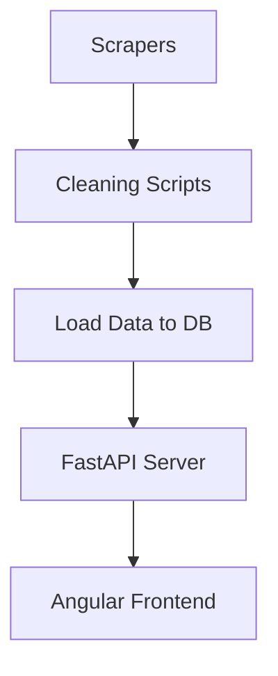

# Angular Frontend Components

## FooterComponent  
This standalone component renders the site footer across all pages.  
- **Files**  
  - `footer.component.ts`: Defines the component and metadata.  
  - `footer.component.html`: Contains the static footer markup.  
  - `footer.component.spec.ts`: Verifies component instantiation.  
- **Relationships**  
  - Imported by `AppComponent` to appear at page bottom.  
- **Key Snippet**  
```html
<footer>
  <div class="container">
    <p>2025 JobBoard. Tous droits réservés.</p>
    <p>Contact : contactjobboard.com</p>
  </div>
</footer>
```

## NavbarComponent  
Provides the top navigation bar with branding and search input.  
- **Files**  
  - `navbar.component.ts`: Declares the standalone navbar and imports `SearchComponent`.  
  - `navbar.component.html`: Renders the logo and search slot.  
  - `navbar.component.spec.ts`: Confirms component creation.  
- **Relationships**  
  - Used in `AppComponent` above the router outlet.  
  - Hosts `<app-search>` for live search.  
- **Key Snippet**  
```html
<header class="navbar">
  <div class="container">
    <h1><a routerLink="/">JobBoard</a></h1>
    <app-search/>
  </div>
</header>
```

## SearchComponent  
Captures user input and updates a global search signal.  
- **Files**  
  - `search.component.ts`: Binds an `<input>` to a reactive signal.  
  - `search.component.html`: Inline template for search field.  
  - `search.component.spec.ts`: Tests component instantiation.  
- **Relationships**  
  - Injects `SearchService` to synchronize search term across components.  
- **Key Snippet**  
```html
<input
  type="text"
  [(ngModel)]="searchTerm"
  placeholder="Rechercher par titre, mot-clé ou pays."
  class="search-input"
/>
```

## JobCardComponent  
Displays individual job details in a card layout.  
- **Files**  
  - `job-card.component.ts`: Defines input properties and formatting logic.  
  - `job-card.component.html`: Inline template shows title, company, badges, skills, salary, and link.  
  - `job-card.component.spec.ts`: Confirms proper component setup.  
- **Relationships**  
  - Consumes a `JobWithSkills` model from `JobService`.  
  - Used inside `JobListComponent` for each job.  
- **Key Snippet**  
```ts
export class JobCardComponent {
  job = input.required<Job & { skillsArray: string[] }>();
  formatSalary() { /* returns salary range or placeholder */ }
}
```

## JobListComponent  
Lists all jobs and applies client‐side filtering.  
- **Files**  
  - `job-list.component.ts`: Fetches jobs, applies search filter, exposes signals.  
  - `job-list.component.html`: Loops over `filteredJobs`, displays cards or no-results message.  
  - `job-list.component.spec.ts`: Validates component creation.  
- **Relationships**  
  - Injects `JobService` to load jobs from API.  
  - Uses `SearchService`’s search term to filter.  
  - Embeds `<app-job-card>` for each job.  
- **Key Snippet**  
```ts
filteredJobs = computed(() => {
  const term = this.searchService.searchTerm();
  const jobs = this.jobService.jobs();
  return term
    ? jobs.filter(/* ...includes logic... */)
    : jobs;
});
```

# Angular Data & Services

## Job Model  
Defines the job data structure and skill parser.  
- **File**: `job.model.ts`  
- **Contents**  
  - `interface Job`: All job fields (id, title, company, etc.).  
  - `parseSkills()`: Splits skills string into array.  

## JobService  
Manages API calls and reactive job state.  
- **File**: `job.service.ts`  
- **Responsibilities**  
  - Fetches jobs from `http://localhost:8000/jobs`.  
  - Stores jobs, loading, and error states as signals.  
  - Transforms raw jobs to include `skillsArray`.  
  - Exposes `searchJobs()`, `refresh()`, and `getJobById()`.  

## SearchService  
Holds a writable signal for the global search term.  
- **File**: `search.service.ts`  
- **Use**  
  - Read and write search term across components.  

# Angular Configuration & Bootstrap

## AppComponent  
Root component embedding navbar, router outlet, and footer.  
- **Files**  
  - `app.component.ts`: Declares `imports: [RouterOutlet, NavbarComponent, FooterComponent]`.  
  - `app.component.html`:  
    ```html
    <app-navbar/><main><router-outlet/></main><app-footer/>
    ```  
  - `app.component.spec.ts`: Basic creation and title tests.  

## Routing & Bootstrap  
- **`app.routes.ts`**: Defines a single route `''` mapping to `JobListComponent` and wildcard redirect.  
- **`app.config.ts`**:  
  - Provides zone change detection, router, and HTTP client for standalone bootstrap.  
- **`main.ts`**:  
  ```ts
  bootstrapApplication(AppComponent, appConfig)
    .catch(err => console.error(err));
  ```  

# Angular Project Files

- **`index.html`**: Mounts `<app-root>` and sets base href.  
- **`angular.json`**: Angular CLI workspace configuration.  
- **`package.json`**: Frontend dependencies and scripts.  
- **TypeScript Configs**:  
  - `tsconfig.json`, `tsconfig.app.json`, `tsconfig.spec.json` for compiler options and test setups.  
- **`README.md`**: Instructions to install and serve the Angular frontend.  

# Data Files

## Raw Data  
Holds unprocessed job data scraped from each site.  
- `src/Data/rawData/job_emploisTunisie.csv`  
- `src/Data/rawData/job_keejobs.csv`  
- `src/Data/rawData/jobs_optioncarriere.csv`  

## Cleaned Data  
Normalized and standardized CSV ready for database loading.  
- `src/Data/cleanedData/job_emploisTunisie_cleaned.csv`  
- `src/Data/cleanedData/job_keejobs_cleaned.csv`  
- `src/Data/cleanedData/jobs_optioncarriere_cleaned.csv`  

# Cleaning Scripts

Each script reads its raw CSV, maps fields to a standard schema, extracts and normalizes dates, locations, salaries, and skills.

- **`emploisTunisie_cleaning.py`**  
- **`keejobs_cleaning.py`**  
- **`optioncarrier_cleaning.py`**  

# Database Setup

## `db_session.py`  
Configures SQLAlchemy engine and session using environment variables.  

## `models.py`  
Defines the `Job` ORM model matching the `jobs` table.  
- Columns: `id`, `job_id` (unique), `source`, `title`, `detail_link`, and all job attributes.  
- Auto-timestamp `scraped_at` with server default.  

## `create_tables.py`  
Invokes metadata creation to generate the `jobs` table in the database.  

# Data Loader

## `loadData.py`  
Reads each cleaned CSV and upserts into the database.  
- Utility functions to parse dates, convert numbers, and generate deterministic `job_id` when missing.  
- Skips existing records (based on `job_id`).  

# Scrapers

Automated data extractors using Selenium. Each writes to its raw CSV.

## EmploisTunisie Scraper  
- **File**: `emploisTunisie.py`  
- Visits `emploitunisie.com`, paginates, denies cookie popups, scrapes list and detail pages.  

## Keejobs Scraper  
- **File**: `keejobs.py`  
- Targets `keejob.com`, accepts cookies, paginates through first three pages, and captures job details.  

## OptionCarriere Scraper  
- **File**: `optioncarrier.py`  
- Crawls `optioncarriere.tn`, initializes CSV, iterates pages via “next” buttons, and scrapes job listings and raw HTML content.  

# Pipeline Orchestration

## `main_pipeline.py`  
Coordinates the full ETL pipeline asynchronously:  
1. **Scraping**: Runs all scrapers in parallel with timeouts.  
2. **Cleaning**: Executes all cleaning scripts concurrently.  
3. **Loading**: Invokes the loader to insert data into the database.  
4. **Summary**: Logs successes, durations, and any errors.  



# API Server

## `server.py`  
Implements a FastAPI application exposing job data.  
- **CORS**: Allows calls from Angular dev server.  
- **Models**: `JobOut` Pydantic schema serializes `Job` ORM.  
- **Endpoints**:  
  - `GET /jobs`:  
    - Query params: `search`, `country`, `limit`, `offset`.  
    - Filters, orders, paginates, and returns job list.  
  - `GET /health`:  
    - Returns status and job count.  
  - `GET /`:  
    - Simple status message and `/docs` link.  

# Requirements

## `requirements.txt`  
Lists all Python dependencies for scrapers, cleaning, pipeline, and FastAPI server, including  
- Selenium, FastAPI, SQLAlchemy, Pandas, Psycopg2, Uvicorn, etc.

---

This documentation captures each file’s role, interactions, and how raw scraped data flows through cleaning, storage, API serving, and the Angular frontend display.